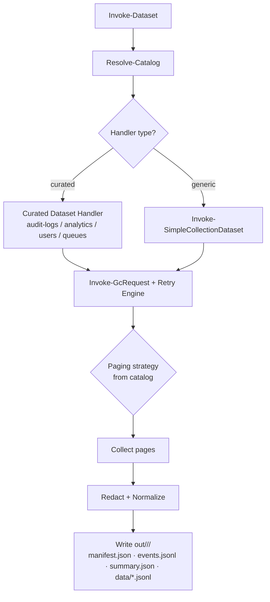

# Genesys.Core

> Catalog-driven PowerShell execution engine for governed Genesys Cloud dataset collection — deterministic retry/paging, structured audit artifacts, and GitHub Actions automation.

[](https://github.com/xfaith4/Genesys.Core/actions/workflows/ci.yml)
[](./LICENSE)
[](https://github.com/PowerShell/PowerShell)

**Keywords:** genesys-cloud, powershell-module, dataset-export, audit-logs, analytics, catalog-driven, pager, retry, github-actions, automation, oauth, etl, workforce-management, contact-center

---

## Why This Exists

Extracting governed, reproducible data from the Genesys Cloud REST API is harder than it should be. Pagination strategies vary by endpoint, 429 rate-limits are inconsistent, async jobs need polling, and sensitive fields leak into logs.

Genesys.Core solves this with a **catalog-driven execution engine**: endpoint behavior (paging strategy, retry profile, async flow, redaction policy) lives in a single JSON catalog — not scattered across scripts. Every run produces identical, auditable output artifacts, making automation, compliance review, and CI integration straightforward.

---

## Key Features

- **Catalog-as-source-of-truth** — 31 dataset keys, 74 endpoint definitions in `genesys-core.catalog.json`; schema-validated before every run
- **Pluggable paging strategies** — `none`, `nextUri`, `pageNumber`, `cursor`, `bodyPaging`, `transactionResults` — selected per endpoint from the catalog
- **Deterministic retry engine** — bounded jitter, `Retry-After` header parsing, message-based fallback; configurable per profile
- **Async transaction pattern** — POST → poll → fetch results for audit logs and analytics jobs
- **Structured run output contract** — every run writes `manifest.json`, `events.jsonl`, `summary.json`, and `data/*.jsonl` under `out/<datasetKey>/<runId>/`
- **No secret leakage** — Authorization headers and token-like query parameters are redacted from all logged events
- **GitHub Actions integration** — scheduled and on-demand workflows for `audit-logs` with artifact upload and configurable retention
- **Windows GUI client** — `GenesysCore-GUI.ps1` wraps `Invoke-Dataset` with an OAuth auth flow, dataset picker, and run log view (WPF, Windows only)
- **PS 5.1 and 7+ compatible** — runs on Windows PowerShell 5.1 and PowerShell 7+

---

## Quickstart

### 1 — Import the module

```powershell
Set-Location <path-to-Genesys.Core>
Import-Module ./src/ps-module/Genesys.Core/Genesys.Core.psd1 -Force
Get-Command -Module Genesys.Core   # Invoke-Dataset, Assert-Catalog
```

### 2 — Acquire an OAuth token (client credentials)

```powershell
$region    = 'mypurecloud.com'           # e.g. usw2.pure.cloud, mypurecloud.de
$baseUri   = "https://api.$($region)"
$authUrl   = "https://login.$($region)/oauth/token"

$authResponse = Invoke-RestMethod -Uri $authUrl -Method POST -Body @{
    grant_type    = 'client_credentials'
    client_id     = '<your-client-id>'
    client_secret = '<your-client-secret>'
} -ContentType 'application/x-www-form-urlencoded'

$headers = @{ Authorization = "Bearer $($authResponse.access_token)" }
```

### 3 — Run a dataset

```powershell
# Dry run (no API calls)
Invoke-Dataset -Dataset 'users' -WhatIf

# Live run
Invoke-Dataset -Dataset 'users' -OutputRoot './out' -BaseUri $baseUri -Headers $headers
```

### 4 — Inspect run output

```powershell
$runFolder = Get-ChildItem './out/users' -Directory | Sort-Object Name -Descending | Select-Object -First 1
Get-Content (Join-Path $runFolder.FullName 'summary.json') | ConvertFrom-Json
```

For full onboarding steps, see [docs/ONBOARDING.md](docs/ONBOARDING.md).

---

## Installation

**Requirements:**

| Requirement | Version |
|---|---|
| Windows PowerShell | 5.1 |
| PowerShell | 7+ (cross-platform) |
| Pester (tests only) | 5.x |
| Network | Genesys Cloud API access |

**Steps:**

```powershell
# Clone the repo
git clone https://github.com/xfaith4/Genesys.Core.git
Set-Location Genesys.Core

# Import the module
Import-Module ./src/ps-module/Genesys.Core/Genesys.Core.psd1 -Force

# (Optional) Validate catalog schema
Assert-Catalog -SchemaPath ./catalog/schema/genesys-core.catalog.schema.json
```

No additional package installation is required for runtime use. Pester is only needed for running tests.

---

## Usage

### List available dataset keys

```powershell
$catalog = Get-Content -Raw ./genesys-core.catalog.json | ConvertFrom-Json
$catalog.datasets.PSObject.Properties.Name | Sort-Object
```

### Common dataset runs

```powershell
# Audit logs (async transaction flow)
Invoke-Dataset -Dataset 'audit-logs' -OutputRoot './out' -BaseUri $baseUri -Headers $headers

<<<<<<< HEAD
$region = 'usw2.pure.cloud'
$baseUri = "https://api.$region"
$authUrl = "https://login.$region/oauth/token"

$clientId = '<client-id>'
$clientSecret = '<client-secret>'

$authResponse = Invoke-RestMethod -Uri $authUrl -Method POST -Body @{
    grant_type = 'client_credentials'
    client_id = $clientId
    client_secret = $clientSecret
} -ContentType 'application/x-www-form-urlencoded'

$headers = @{
    "Authorization" = "Bearer $($authResponse.access_token)"
    "Content-Type"  = "application/json"
}
=======
# Analytics conversation details (async job flow)
Invoke-Dataset -Dataset 'analytics-conversation-details' -OutputRoot './out' -BaseUri $baseUri -Headers $headers
>>>>>>> 165460301f03b7723da3cdb7210d89f3889bc58a

# Users (normalized user projection, paginated)
Invoke-Dataset -Dataset 'users' -OutputRoot './out' -BaseUri $baseUri -Headers $headers

# Routing queues (normalized queue projection, paginated)
Invoke-Dataset -Dataset 'routing-queues' -OutputRoot './out' -BaseUri $baseUri -Headers $headers
```

All other keys in the catalog (27 additional) run via generic catalog-driven dispatch when endpoint metadata is present.

### Standalone script invocation (dry runs / CI bootstrap)

```powershell
# WhatIf — validates catalog and prints plan; no API calls made
pwsh -NoProfile -File ./src/ps-module/Genesys.Core/Public/Invoke-Dataset.ps1 -Dataset audit-logs -WhatIf
```

> **Note:** Script-level invocation does not currently expose `-Headers` or `-BaseUri`. For authenticated live API runs, import the module and call `Invoke-Dataset` directly.

### Windows GUI

```powershell
.\GenesysCore-GUI.ps1
```

The WPF GUI provides an OAuth auth flow, dataset selection from the catalog, run/what-if execution, and an execution log view. **Windows only** (requires WPF).

---

## Configuration

### Environment variables (GitHub Actions workflows)

| Name | Required | Description |
|---|---|---|
| `GENESYS_BEARER_TOKEN` | Yes (workflows) | OAuth bearer token injected as a GitHub Actions secret |

### Key `Invoke-Dataset` parameters

| Parameter | Required | Description |
|---|---|---|
| `-Dataset` | Yes | Dataset key from the catalog (e.g. `users`, `audit-logs`) |
| `-OutputRoot` | No | Root folder for run output (default: `./out`) |
| `-BaseUri` | No* | Genesys Cloud API base URI (e.g. `https://api.mypurecloud.com`) |
| `-Headers` | No* | Hashtable with `Authorization` bearer token |
| `-WhatIf` | No | Dry run; validates catalog and prints plan without calling the API |
| `-StrictCatalog` | No | Fail if root and mirror catalogs diverge |

\* Required for live API runs.

### Catalog loading precedence

`Resolve-Catalog` loads catalogs in this order:

1. Root `./genesys-core.catalog.json` ← **canonical**
2. Fallback: `./catalog/genesys-core.catalog.json` (compatibility mirror)

If both exist and differ, a warning is emitted. Use `-StrictCatalog` to fail instead.

To sync the mirror from the canonical root:

```powershell
Copy-Item ./genesys-core.catalog.json ./catalog/genesys-core.catalog.json -Force
```

---

## Architecture

### High-level flow



### Run output contract

Every run writes under `out/<datasetKey>/<runId>/`:

| File | Description |
|---|---|
| `manifest.json` | Dataset key, time window, git SHA, start/end times, record counts, warnings |
| `events.jsonl` | Structured events: retries, 429 backoffs, paging progress, async poll states |
| `summary.json` | Fast "coffee view" of the run |
| `data/*.jsonl` | Normalized, redacted dataset records (or `.jsonl.gz`) |

### Repository layout

```
genesys-core.catalog.json          # Catalog (source of truth)
catalog/
  schema/genesys-core.catalog.schema.json  # JSON Schema
  genesys-core.catalog.json        # Compatibility mirror
src/ps-module/Genesys.Core/
  Genesys.Core.psd1                # Module manifest (v0.1.0, PS 5.1+)
  Genesys.Core.psm1
  Public/
    Invoke-Dataset.ps1             # Primary entrypoint
  Private/
    Async/                         # Submit-AsyncJob, poll, fetch
    Catalog/                       # Resolve-Catalog, Assert-Catalog
    Datasets/                      # Curated + generic handlers
    Http/                          # Invoke-GcRequest, Invoke-CoreEndpoint
    Paging/                        # Paging strategy plugins
    Redaction/                     # Header/token redaction
    Retry/                         # Retry engine with jitter
    Run/                           # Run contract writers
GenesysCore-GUI.ps1                # Windows WPF GUI client
scripts/
  Invoke-Smoke.ps1                 # Smoke test runner
  Update-CatalogFromSwagger.ps1    # Refresh catalog from Swagger
  Sync-SwaggerEndpoints.ps1
tests/
  CatalogSchema.Tests.ps1
  Retry.Tests.ps1
  Paging.Tests.ps1
  AsyncJob.Engine.Tests.ps1
  Security.Redaction.Tests.ps1
  RunContract.Tests.ps1
  ... (14 test files total)
.github/workflows/
  ci.yml                           # Pester on pull_request + workflow_dispatch
  audit-logs.scheduled.yml         # Scheduled daily run
  audit-logs.on-demand.yml         # Manual trigger with time-window inputs
docs/
  ONBOARDING.md
  ROADMAP.md
  CHANGELOG.md
```

---

## Development

### Run tests (Pester)

```powershell
# Install Pester if not already installed
Install-Module -Name Pester -Force -Scope CurrentUser -SkipPublisherCheck

# Run full test suite
$config = . ./tests/PesterConfiguration.ps1
Invoke-Pester -Configuration $config
```

### Run smoke checks

```powershell
pwsh -NoProfile -File ./scripts/Invoke-Smoke.ps1
```

### Sync catalog from Swagger

```powershell
# Refresh from bundled Swagger snapshot
pwsh -NoProfile -File ./scripts/Update-CatalogFromSwagger.ps1 -WriteLegacyCopy

# Refresh from a custom Swagger file
pwsh -NoProfile -File ./scripts/Update-CatalogFromSwagger.ps1 -SwaggerPath ./my/swagger.json -WriteLegacyCopy
```

### CI

The `ci.yml` workflow runs Pester on every pull request and on manual dispatch using `ubuntu-latest` with PowerShell 7.

---

## Roadmap

See [docs/ROADMAP.md](docs/ROADMAP.md) for the full roadmap. Current status summary:

- ✅ **Phase 0** — Module scaffold, catalog, schema, CI, workflow scaffolding
- ✅ **Phase 1** — Retry engine, paging plugins, structured events, redaction
- 🔄 **Phase 2** — Curated dataset handlers (4 complete; generic dispatch covers the rest); parameterization improvements in progress
- 🔄 **Phase 3** — Catalog mirror consolidation; production workflow auth ergonomics
- 📋 **Phase 4** — Endpoint expansion: `authorization/roles`, `oauth/clients`, `recordings`, `speechandtextanalytics`, and more

---

## Contributing

Contributions are welcome. Please follow these steps:

1. Fork the repository and create a feature branch.
2. Make your changes; ensure `Invoke-Pester` passes with no failures.
3. Add or update catalog entries with valid `paging` and `retry` profile fields.
4. Verify PS 5.1 and PS 7 compatibility (avoid PS 7-only features).
5. Open a pull request against `main`.

Pull request checklist (from [AGENTS.md](./AGENTS.md)):

- [ ] Catalog entry added/updated with schema-valid fields
- [ ] Paging profile exists and is tested/mocked
- [ ] No secrets or PII in logs
- [ ] PS 5.1 + 7+ compatible
- [ ] Run outputs follow contract; artifact upload only includes the run folder

---

## Security

If you discover a security vulnerability, please **do not open a public issue**. Instead, contact the maintainers privately via GitHub's [private vulnerability reporting](https://github.com/xfaith4/Genesys.Core/security/advisories/new).

The engine enforces the following data safety rules:

- `Authorization` headers are always redacted from logged events.
- Token-like query parameters are redacted before persistence.
- Raw payload storage is opt-in and never the default.

---

## License

[MIT](./LICENSE) — Copyright (c) 2026 XFaith

---

## Topics to Add on GitHub

Suggested repository topics for discoverability:

`genesys-cloud` · `powershell` · `powershell-module` · `dataset-export` · `audit-logs` · `analytics` · `github-actions` · `automation` · `etl` · `contact-center` · `workforce-management` · `oauth` · `pager` · `retry` · `catalog`

## Alternative Names / Related Terms

This project may also be described as:
- Genesys Cloud data extractor
- Genesys Cloud PowerShell ETL
- Genesys Cloud audit log automation
- Governed dataset collection engine for Genesys
