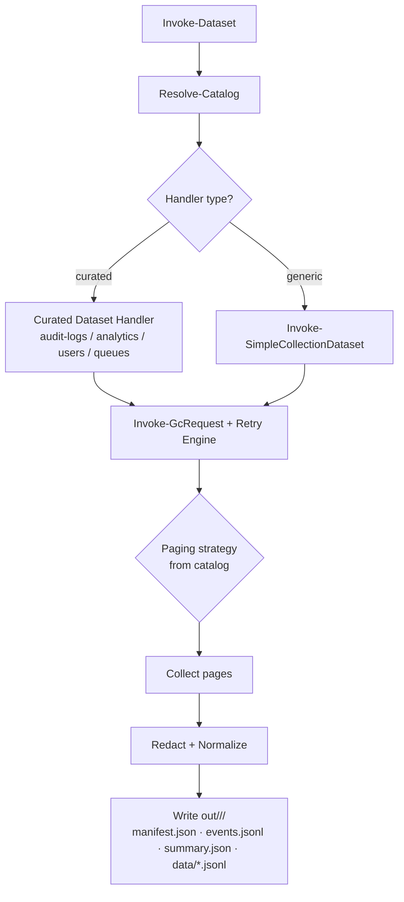

# Genesys.Core

> Catalog-driven PowerShell execution engine for governed Genesys Cloud dataset collection and composed investigations — deterministic retry/paging, structured audit artifacts, and GitHub Actions automation.

[](https://github.com/your-org/Genesys.Core/actions/workflows/ci.yml)
[](./LICENSE)
[](https://github.com/PowerShell/PowerShell)

**Keywords:** genesys-cloud, powershell-module, dataset-export, audit-logs, analytics, catalog-driven, pager, retry, github-actions, automation, oauth, etl, workforce-management, contact-center

---

## Why This Exists

Extracting governed, reproducible data from the Genesys Cloud REST API is harder than it should be. Pagination strategies vary by endpoint, 429 rate-limits are inconsistent, async jobs need polling, and sensitive fields leak into logs.

Genesys.Core solves this with a **catalog-driven execution engine**: endpoint behavior (paging strategy, retry profile, async flow, redaction policy) lives in a single JSON catalog — not scattered across scripts. Every run produces identical, auditable output artifacts, making automation, compliance review, and CI integration straightforward.

The Ops layer builds on that contract with **investigations**: subject-centred compositions that run multiple datasets and emit the same artifact shape under `out/<investigationKey>/<runId>/`. The first flagship is Agent Investigation, which joins identity, division, skills, queue memberships, presence, activity, and touched conversations for one agent.

---

## Key Features

- **Catalog-as-source-of-truth** — 31 dataset keys, 74 endpoint definitions in `genesys.catalog.json`; schema-validated before every run
- **Pluggable paging strategies** — `none`, `nextUri`, `pageNumber`, `cursor`, `bodyPaging`, `transactionResults` — selected per endpoint from the catalog
- **Deterministic retry engine** — bounded jitter, `Retry-After` header parsing, message-based fallback; configurable per profile
- **Async transaction pattern** — POST → poll → fetch results for audit logs and analytics jobs
- **Structured run output contract** — every run writes `manifest.json`, `events.jsonl`, `summary.json`, and `data/*.jsonl` under `out/<datasetKey>/<runId>/`
- **Investigation composition** — `Get-GenesysAgentInvestigation` emits the same artifact set for a joined, agent-centred investigation under `out/agent-investigation/<runId>/`
- **No secret leakage** — Authorization headers and token-like query parameters are redacted from all logged events
- **GitHub Actions integration** — scheduled and on-demand workflows for `audit-logs` with artifact upload and configurable retention
- **Conversation Analysis web app** — `apps/ConversationAnalysis/index.html`, a self-contained SPA for exploring run artifacts (no build, no server)
- **Windows GUI client** — `GenesysCore-GUI.ps1` wraps `Invoke-Dataset` with an OAuth auth flow, dataset picker, and run log view (WPF, Windows only)
- **PS 5.1 and 7+ compatible** — runs on Windows PowerShell 5.1 and PowerShell 7+

---

## Quickstart

### 1 — Import the module

```powershell
Set-Location <path-to-Genesys.Core>
Import-Module ./modules/Genesys.Core/Genesys.Core.psd1 -Force
Get-Command -Module Genesys.Core   # Invoke-Dataset, Assert-Catalog
```

### 2 — Acquire an OAuth token (client credentials)

```powershell
$region    = 'usw2.pure.cloud'           # e.g. usw2.pure.cloud, mypurecloud.de
$baseUri   = "https://api.$($region)"
$authUrl   = "https://login.$($region)/oauth/token"

$authResponse = Invoke-RestMethod -Uri $authUrl -Method POST -Body @{
    grant_type    = 'client_credentials'
    client_id     = '<your-client-id>'
    client_secret = '<your-client-secret>'
} -ContentType 'application/x-www-form-urlencoded'

$headers = @{ Authorization = "Bearer $($authResponse.access_token)" }
```

### 3 — Run a dataset

```powershell
# Dry run (no API calls)
Invoke-Dataset -Dataset 'users' -WhatIf

# Live run
Invoke-Dataset -Dataset 'users' -OutputRoot './out' -BaseUri $baseUri -Headers $headers
```

### 3b — Run an Agent Investigation

```powershell
Import-Module ./modules/Genesys.Ops/Genesys.Ops.psd1 -Force
Connect-GenesysCloud -AccessToken $authResponse.access_token -Region $region

Get-GenesysAgentInvestigation -UserId '<genesys-user-guid>' -Since (Get-Date).AddDays(-7) -OutputRoot './out'
```

### 4 — Inspect run output

```powershell
$runFolder = Get-ChildItem './out/users' -Directory | Sort-Object Name -Descending | Select-Object -First 1
Get-Content (Join-Path $runFolder.FullName 'summary.json') | ConvertFrom-Json
```

For full onboarding steps, see [docs/ONBOARDING.md](docs/ONBOARDING.md).
For engineering integration/auth patterns across PowerShell, HTML/JS, .NET, and Go, see [docs/ENGINEER_INTEGRATIONS_AUTH.md](docs/ENGINEER_INTEGRATIONS_AUTH.md).

---

## Installation

**Requirements:**

| Requirement | Version |
|---|---|
| Windows PowerShell | 5.1 |
| PowerShell | 7+ (cross-platform) |
| Pester (tests only) | 5.x |
| Network | Genesys Cloud API access |

**Steps:**

```powershell
# Clone the repo
git clone https://github.com/xfaith4/Genesys.Core.git
Set-Location Genesys.Core

# Import the module
Import-Module ./modules/Genesys.Core/Genesys.Core.psd1 -Force

# (Optional) Validate catalog schema
Assert-Catalog -SchemaPath ./catalog/schema/genesys.catalog.schema.json
```

No additional package installation is required for runtime use. Pester is only needed for running tests.

---

## Usage

### List available dataset keys

```powershell
$catalog = Get-Content -Raw ./catalog/genesys.catalog.json | ConvertFrom-Json
$catalog.datasets.PSObject.Properties.Name | Sort-Object
```

### Common dataset runs

```powershell
# Audit logs (async transaction flow)
Invoke-Dataset -Dataset 'audit-logs' -OutputRoot './out' -BaseUri $baseUri -Headers $headers

# Analytics conversation details (async job flow)
Invoke-Dataset -Dataset 'analytics-conversation-details' -OutputRoot './out' -BaseUri $baseUri -Headers $headers

# Users (normalized user projection, paginated)
Invoke-Dataset -Dataset 'users' -OutputRoot './out' -BaseUri $baseUri -Headers $headers

# Routing queues (normalized queue projection, paginated)
Invoke-Dataset -Dataset 'routing-queues' -OutputRoot './out' -BaseUri $baseUri -Headers $headers
```

All other keys in the catalog (27 additional) run via generic catalog-driven dispatch when endpoint metadata is present.

### Investigation runs

```powershell
Import-Module ./modules/Genesys.Ops/Genesys.Ops.psd1 -Force
Connect-GenesysCloud -AccessToken $env:GENESYS_BEARER_TOKEN -Region 'usw2.pure.cloud'

# Resolve by name in the wrapper, then compose the investigation by UserId.
Get-GenesysAgentInvestigation -UserName 'Jane Doe' -Since (Get-Date).AddDays(-7) -OutputRoot './out'
```

Investigation output follows the same artifact contract as datasets, with an investigation manifest schema at `catalog/schema/investigation.manifest.schema.json`. See [docs/INVESTIGATIONS.md](docs/INVESTIGATIONS.md) for the composition contract and release sequencing.

### Standalone script invocation (dry runs / CI bootstrap)

```powershell
# WhatIf — validates catalog and prints plan; no API calls made
pwsh -NoProfile -File ./modules/Genesys.Core/Public/Invoke-Dataset.ps1 -Dataset audit-logs -WhatIf
```

> **Note:** Script-level invocation now supports `-BaseUri`, `-Headers`, and `-DatasetParameters`, but importing the module is still recommended for reusable sessions.

### Windows GUI

```powershell
.\GenesysCore-GUI.ps1
```

The WPF GUI provides an OAuth auth flow, dataset selection from the catalog, run/what-if execution, and an execution log view. **Windows only** (requires WPF).

---

## Configuration

### Environment variables (GitHub Actions workflows)

| Name | Required | Description |
|---|---|---|
| `GENESYS_BEARER_TOKEN` | Yes (workflows) | OAuth bearer token injected as a GitHub Actions secret |

### Key `Invoke-Dataset` parameters

| Parameter | Required | Description |
|---|---|---|
| `-Dataset` | Yes | Dataset key from the catalog (e.g. `users`, `audit-logs`) |
| `-OutputRoot` | No | Root folder for run output (default: `./out`) |
| `-BaseUri` | No* | Genesys Cloud API base URI (e.g. `https://api.mypurecloud.com`) |
| `-Headers` | No* | Hashtable with `Authorization` bearer token |
| `-WhatIf` | No | Dry run; validates catalog and prints plan without calling the API |
| `-DatasetParameters` | No | Dataset runtime overrides (intervals, query overrides, dataset-specific knobs) |
| `-StrictCatalog` | No | Retained as a backward-compatible no-op after mirror-catalog retirement |

\* Required for live API runs.

### Catalog loading precedence

`Resolve-Catalog` loads catalogs in this order:

1. Explicit `-CatalogPath` when supplied.
2. `./catalog/genesys.catalog.json` ← **canonical**

The legacy `genesys-core.catalog.json` mirror has been retired. If no catalog is found at the canonical path (and no explicit `-CatalogPath` is given) `Resolve-Catalog` throws.

---

## Architecture

### High-level flow



### Run output contract

Every run writes under `out/<datasetKey>/<runId>/`:

| File | Description |
|---|---|
| `manifest.json` | Dataset key, time window, git SHA, start/end times, record counts, warnings |
| `events.jsonl` | Structured events: retries, 429 backoffs, paging progress, async poll states |
| `summary.json` | Fast "coffee view" of the run |
| `data/*.jsonl` | Normalized, redacted dataset records (or `.jsonl.gz`) |

### Repository layout

```
Genesys.Core/
├── catalog/
│   ├── genesys.catalog.json               # Canonical catalog (source of truth)
│   └── schema/
│       └── genesys.catalog.schema.json    # JSON Schema
├── modules/
│   ├── Genesys.Auth/                      # OAuth flows, token lifecycle
│   │   ├── Genesys.Auth.psd1
│   │   └── Genesys.Auth.psm1
│   ├── Genesys.Core/                      # Catalog-driven runtime engine
│   │   ├── Genesys.Core.psd1
│   │   ├── Genesys.Core.psm1
│   │   ├── Public/
│   │   │   └── Invoke-Dataset.ps1         # Primary entrypoint
│   │   └── Private/
│   │       ├── Async/                     # Invoke-AsyncJob, poll, fetch
│   │       ├── Catalog/                   # Resolve-Catalog, Assert-Catalog
│   │       ├── Datasets/                  # Curated + generic handlers
│   │       ├── Http/                      # Invoke-GcRequest, Invoke-CoreEndpoint
│   │       ├── Paging/                    # Paging strategy plugins
│   │       ├── Redaction/                 # Header/token redaction
│   │       ├── Retry/                     # Retry engine with jitter
│   │       └── Run/                       # Run contract writers
│   └── Genesys.Ops/                       # IT-Ops convenience cmdlets
│       ├── Genesys.Ops.psd1
│       └── Genesys.Ops.psm1
├── apps/
│   └── ConversationAnalysis/
│       ├── index.html                     # Self-contained SPA (no build required)
│       └── README.md
├── scripts/
│   ├── Invoke-Smoke.ps1                   # Smoke test runner
│   ├── Invoke-Tests.ps1                   # Full test runner
│   ├── Invoke-GenesysCoreBridge.ps1       # CLI bridge for non-PS wrappers
│   ├── Update-CatalogFromSwagger.ps1      # Refresh catalog from Swagger
│   └── Sync-SwaggerEndpoints.ps1
├── tests/
│   ├── unit/                              # 16 Pester test files
│   └── integration/
│       └── workflow-simulation.ps1
├── docs/
│   ├── ONBOARDING.md
│   ├── ROADMAP.md
│   ├── CHANGELOG.md
│   ├── REPO_SCHEMATIC.md
│   ├── ENGINEER_INTEGRATIONS_AUTH.md
│   └── training/
│       └── genesys-onboarding.html        # Interactive training page
├── GenesysCore-GUI.ps1                    # Windows WPF GUI client
└── .github/workflows/
    ├── ci.yml                             # Pester on pull_request + workflow_dispatch
    ├── audit-logs.scheduled.yml           # Scheduled daily run
    └── audit-logs.on-demand.yml           # Manual trigger with time-window inputs
```

---

## Development

### Run tests (Pester)

```powershell
# Install Pester if not already installed
Install-Module -Name Pester -Force -Scope CurrentUser -SkipPublisherCheck

# Run full test suite
$config = . ./tests/PesterConfiguration.ps1
Invoke-Pester -Configuration $config
```

For a comprehensive testing guide, see [TESTING.md](TESTING.md).

### Run smoke checks

```powershell
pwsh -NoProfile -File ./scripts/Invoke-Smoke.ps1
```

### Sync catalog from Swagger

```powershell
# Refresh from bundled Swagger snapshot
pwsh -NoProfile -File ./scripts/Update-CatalogFromSwagger.ps1 -WriteLegacyCopy

# Refresh from a custom Swagger file
pwsh -NoProfile -File ./scripts/Update-CatalogFromSwagger.ps1 -SwaggerPath ./my/swagger.json -WriteLegacyCopy
```

### CI

The `ci.yml` workflow runs Pester on every pull request and on manual dispatch using `ubuntu-latest` with PowerShell 7.

---

## Roadmap

See [docs/ROADMAP.md](docs/ROADMAP.md) for the full roadmap. Current status summary:

- ✅ **Phase 0** — Module scaffold, catalog, schema, CI, workflow scaffolding
- ✅ **Phase 1** — Retry engine, paging plugins, structured events, redaction
- 🔄 **Phase 2** — Curated dataset handlers (4 complete; generic dispatch covers the rest); parameterization improvements in progress
- 🔄 **Phase 3** — Catalog mirror consolidation; production workflow auth ergonomics
- 📋 **Phase 4** — Endpoint expansion: `authorization/roles`, `oauth/clients`, `recordings`, `speechandtextanalytics`, and more

---

## CI Testing Notes

> **Why CI does not perform real Genesys Cloud calls**

GitHub Actions runners in this repository have no access to a Genesys Cloud organisation, and no bearer token is stored as a secret (by design — storing production credentials in a public or shared repository is a security risk).

To keep CI passing and still provide meaningful validation, all Genesys Cloud API interactions in the `audit-logs.scheduled.yml` and `audit-logs.on-demand.yml` workflows are **virtualized**:

- The dataset run step creates the identical output folder structure (`manifest.json`, `events.jsonl`, `summary.json`, `data/audit.jsonl`) that a real run produces, populated with clearly-labelled mock records.
- Every mocked action is prefixed with `MOCK:` in the workflow log so reviewers can instantly distinguish virtualized steps from real API activity.
- The artifact upload step receives the mock output and succeeds normally, producing a downloadable artifact with the same schema as a real run.
- The `events.jsonl` file includes a `mock.api.skipped` event as a permanent transparency marker.

**What is still tested in CI:**

| Check | How |
|---|---|
| Output folder/file structure | Created and validated in the mock step |
| JSON schema of all output files | Written and structure-checked by the mock step |
| Artifact upload / retention | `actions/upload-artifact` receives real files |
| Pester unit tests (all 16 files) | Run via `ci.yml` on every PR; all API calls are already mocked via `RequestInvoker` |

**Real integration tests** (live API calls with a valid bearer token) must be run locally or in an environment where the `GENESYS_BEARER_TOKEN` secret is available.

---

## Contributing

Contributions are welcome. Please follow these steps:

1. Fork the repository and create a feature branch.
2. Make your changes; ensure `Invoke-Pester` passes with no failures.
3. Add or update catalog entries with valid `paging` and `retry` profile fields.
4. Verify PS 5.1 and PS 7 compatibility (avoid PS 7-only features).
5. Open a pull request against `main`.

Pull request checklist (from [.agents/AGENTS.md](.agents/AGENTS.md)):

- [ ] Catalog entry added/updated with schema-valid fields
- [ ] Paging profile exists and is tested/mocked
- [ ] No secrets or PII in logs
- [ ] PS 5.1 + 7+ compatible
- [ ] Run outputs follow contract; artifact upload only includes the run folder

---

## Security

If you discover a security vulnerability, please **do not open a public issue**. Instead, contact the maintainers privately via GitHub's [private vulnerability reporting](https://github.com/your-org/Genesys.Core/security/advisories/new).

The engine enforces the following data safety rules:

- `Authorization` headers are always redacted from logged events.
- Token-like query parameters are redacted before persistence.
- Raw payload storage is opt-in and never the default.

---

## License

[MIT](./LICENSE) — Copyright (c) 2026 Genesys.Core contributors
